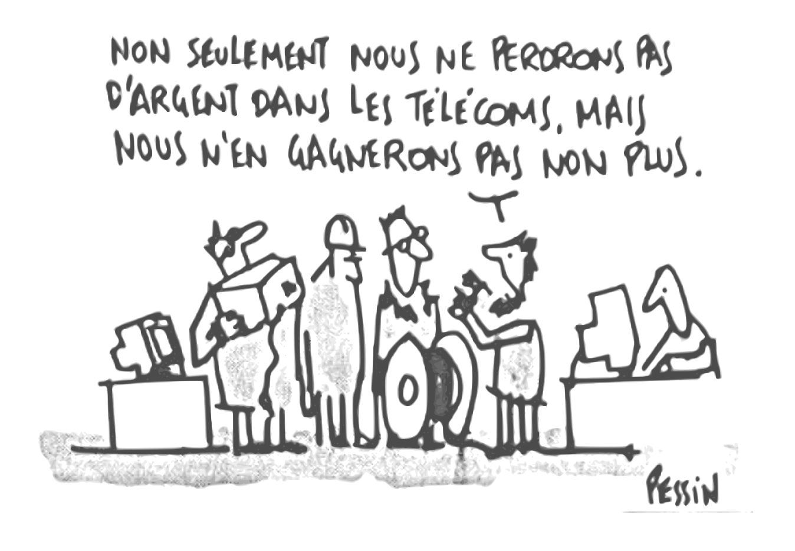

toc_run: false
Title: Accueil
Url:
Template: home
save_as: index.html

<section class="col1of1 m3t">
  

    <h1>Gitoyen</h1>
    <h2>Opérateur réseau, LIR et dinosaures.</h2>
  

  

  <blockquote class="col1of2">
" Pour qu'Internet reste neutre et décentralisé. "
</blockquote>
  

  

  

  

  Gitoyen est une association loi 1901, à but non lucratif. Notre objectif ? Un internet décentralisé et neutre, notamment en facilitant l'émergence et l'existence de petits opérateurs réseau.
  

  

</section>

<section class="col1of1 m1y">

  <h3>Nos valeurs</h3>
  

  

  

    

      
    

    <h4>Pas de profits</h4>
    
Construire un opérateur sans but lucratif et respectant la neutralité du réseau.

  

  

    
    <h4>Du partage</h4>
    
Partager nos connaissances, nos expériences avec les autres bénévoles.

  

  

    
    <h4>De l'entraide</h4>
    
Aider d'autres opérateurs sans but lucratif à faire de même.

  

  <a href="gitoyen.html" class="bouton">Plus d'info sur Gitoyen</a>

</section>

<section class="col1of1 m1y">

  <h3>Nos services</h3>
  

  <ul class="services">
    <li class="col1of2 row8">
    1.
    <h4>Transit Internet</h4>
    
Gitoyen est un opérateur Internet disposant de ses propres liens de communication avec le reste d'Internet. Dans ce cadre nous sommes en mesure de fournir une vue complète d'Internet (du Transit) à nos membres ou nos clients.

    </li>

    <li class="col1of2 row8">
    2.
    <h4>LIR / obtention de ressources Internet</h4>
    
Gitoyen est un registre local d'Internet (LIR). Cela lui donne la possibilité d'assigner des ressources : blocs d'adresses IP ou numéros d'AS.

    </li>

    <li class="col1of2 row8">
    3. 
    <h4>Commutation et routage</h4>
    
Nous proposons à nos membres la possibilité d'utiliser notre infrastructure de commutation et notre infrastructure de routage.

    </li>

    <li class="col1of2 row8">
    4.
    <h4>Hébergement d'équipement</h4>
    
Gitoyen dispose de deux points de présence basés à Paris avec notre propre espace d'hébergement d'équipement. L'un à Téléhouse - Paris Voltaire et l'autre à Paris Bourse.  

    </li>
  </ul>
  <a href="services-de-gitoyen.html" class="bouton">Le détail de nos services</a>

</section>

<section class="col1of1 m1y">
  <h3>Actualités</h3>
  

</section>
