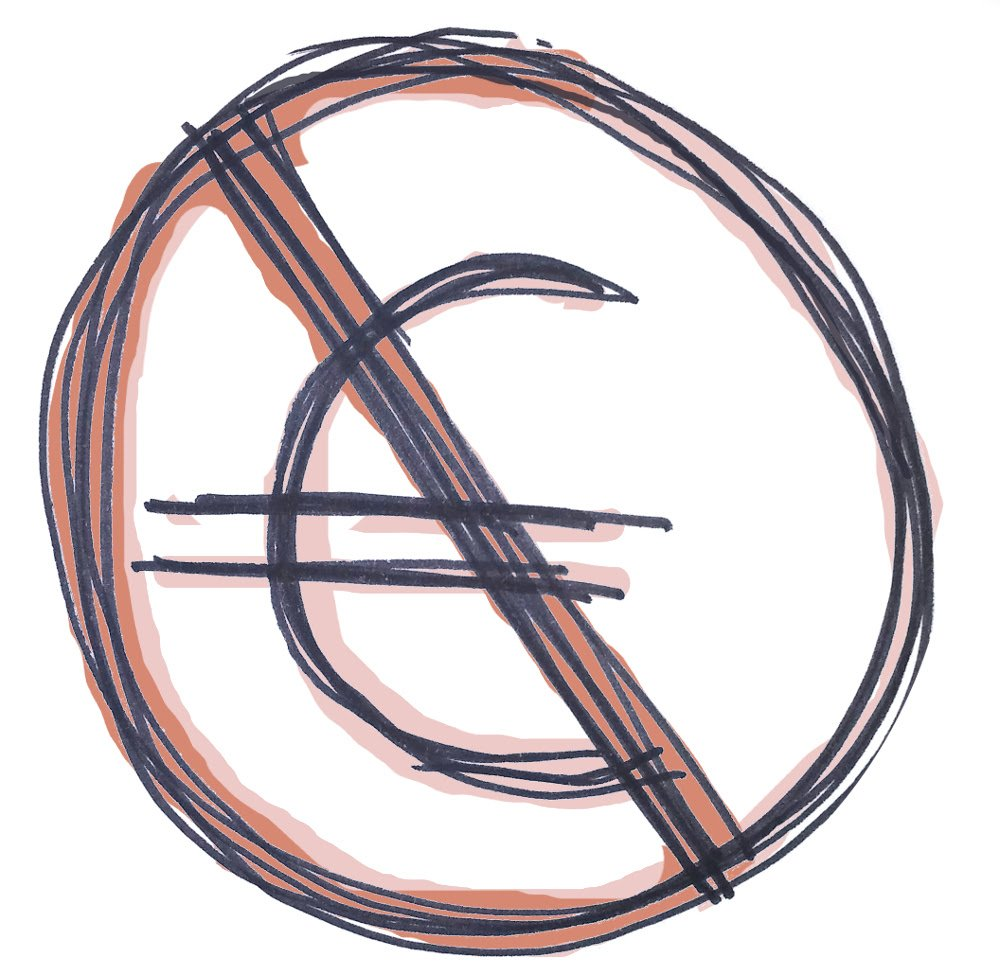
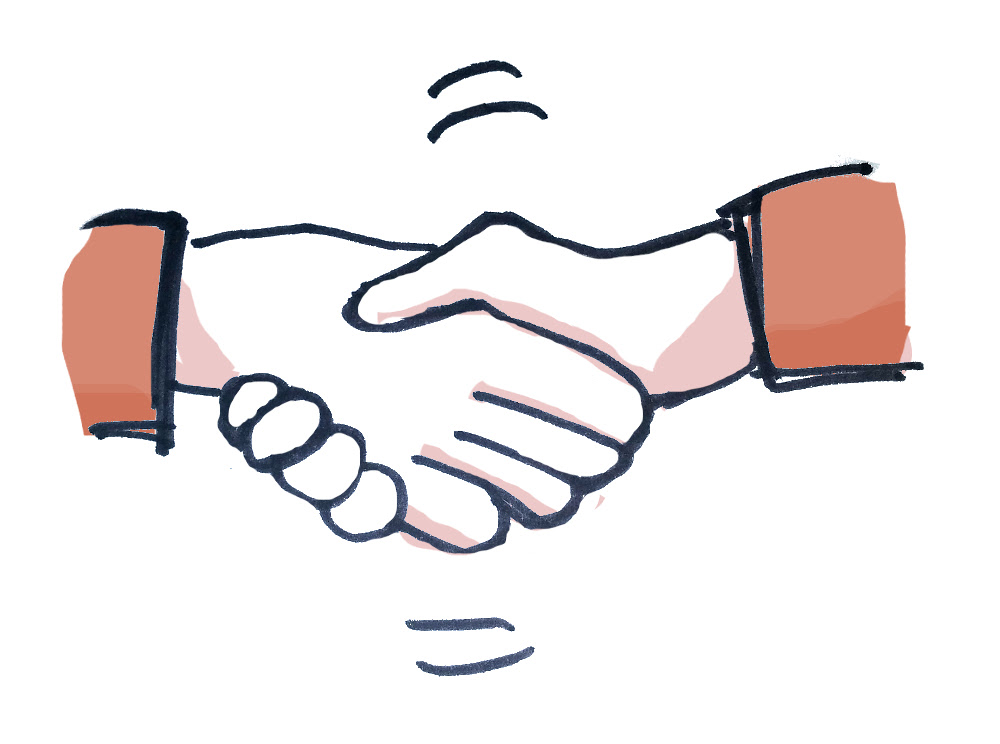

Title: Gitoyen, opérateur réseau alternatif
Slug: gitoyen
Entry: Gitoyen

## Qui est Gitoyen ?

Gitoyen est depuis Janvier 2012 une association loi 1901. Elle a pour
but de faciliter l'émergence et l'existence de petits opérateurs
réseaux, en particulier dans le but de décentraliser Internet.

Cette association est née de la volonté de mutualiser le réseau entre plusieurs
structures ainsi qu'une volonté de créer un espace de partage de la
connaissance et du savoir autour de la fabrication de l'Internet en dehors du
champ mercantile.

L'association Gitoyen est ouverte aux structures qui partagent sa
démarche.

## Nos valeurs

  

    
    
Pas de profit

  

  

    
    
Du partage

  

  

    
    
De l'entraide

  

Notre participation à Gitoyen, sous forme de bénévolat, nous permet de :

* construire un opérateur sans but lucratif, respectant la neutralité du Net,
* partager nos connaissances, nos expériences entre les bénévoles,
* aider d'autres opérateurs sans but lucratif à faire de même.

## Histoire de l'association

### La rencontre

C'est lors de la Zelig Conf de 2001, réunion d'activistes et médias
alternatifs œuvrant entre autre sur Internet, que se sont rencontrés
Globenet, Placenet et Netaktiv, bien vite rejoints par FDN et Gandi, un
nouveau bourgeon de l'Internet solidaire pouvait naître…

### L'objet connecté non identifié

Depuis le temps qu'on en rêvait, nous autres qui croyions à un
Internet qui serait d'abord un outil citoyen avant d'être un système
de vente à distance.

Depuis le temps qu'on y pensait, à offrir l'indépendance à tous ceux
qui veulent s'exprimer et ne pas vendre, ni faire le jeu des marchands
en leur offrant des contenus qu'ils savent si bien rentabiliser.

Le 9 février 2001, nous avons cessé de nous contenter d'imaginer un
Internet solidaire, et nous avons créé Gitoyen. Gitoyen était alors un
groupement d'intérêt économique. Ça sonne comme un truc bassement
matérialiste, mais regrouper des gens qui partagent un idéal commun
pour mutualiser des ressources, et ce faisant être en position
d'offrir à ceux qui voudront nous rejoindre une indépendance plus
grande, et forcément économique dans un monde qui ne comprend plus
d'autre type d'indépendance, c'est dans l'ordre naturel des choses,
finalement.

[FDN](http://www.fdn.fr/), [Gandi](http://www.gandi.net/),
[Globenet](http://www.globenet.org/),
[Netaktiv](http://www.netaktiv.com/) et
[Placenet](http://www.placenet.org/) ont donc choisi de mettre
en commun leurs compétences et leurs moyens pour créer un nouveau
fournisseur d'infrastructure d'hébergement et d'accès à Internet.

L'objectif aussi était nouveau : il s'agit « de fournir une offre
alternative dans un but non marchand et un cadre principalement
citoyen, associatif et social ». Nous voulons permettre l'existence
d'un Internet non marchand indépendant du monde marchand : quoi de
plus logique ? La nouveauté c'est aussi que Gitoyen n'a aucune
vocation de rentabilité.

Qu'au delà des idéaux communs de ses membres, il est apparu qu'il
était désormais possible de créer en France une structure d'accueil de
tous celles et ceux qui partagent ces idéaux, et que puisque c'est possible,
alors il faut le faire.

Le financement de Gitoyen est entièrement assuré par ses membres, et
ne nécessite aucun apport extérieur. À l'image d'Internet tout entier,
c'est la mise en commun des ressources qui a permis les économies
d'échelle nécessaires à la réalisation de ce rêve.

### Un long chemin

Le rêve s'est donc réalisé en 2001. Comme tout projet un peu fou, il emprunta
alors un chemin sinueux vers une maturité désormais acquise. Certains sont
partis (Gandi, Placenet, Cursys, Artefact) et d'autres nous ont rejoint (Altern,
L'autre.net, LDN, Neutrinet, Franciliens.net, Ilico, Illyse, Grenode,
Tetaneutral.net et Rézine), et l'esprit du réseau reste le même.

## L'équipage

Une partie d'entre nous a étudié l'informatique à l'école, d'autres non. Au fil
des années, nous avons acquis de bonnes connaissances dans le domaine des
réseaux grâce à nos pratiques (professionnelles, associatives, personnelles) et
nos échanges avec d'autres, dans la même pièce ou à l'autre bout du monde. Une
partie d'entre nous exerce une activité professionnelle dans l'informatique,
elle est pour l'autre un outil au service de leur activité ou une passion.

## Règlement Intérieur

* [Format PDF](upload/gitoyen-reglement-interieur-20111026.pdf)

## Gitoyen est membre de

* [Fédération FDN](http://www.ffdn.org/)
* [Ring NLnog](http://ring.nlnog.net/)
* [The DCP Bay](http://tdcpb.org/)

Gitoyen est membre ou est présent sur plusieurs points d'échange (aussi appelés IX).

* [FranceIX](http://www.franceix.net)
* [EquinIX](http://www.equinix.net)
* [DEC-IX](https://www.de-cix.net/en/locations/germany/frankfurt)
* [AMSIX](http://amsix.net)
* [SfinIX](http//renater.fr/Sfinx)

Nos points de peering sont listés sur la page de l'AS20766 sur [peeringdb](https://as20766.peeringdb.com)

## Les membres de Gitoyen

Les membres de Gitoyen sont, à ce jour

* [Altern](http://www.altern.org/), la société de Valentin Lacambre.
* [FDN](http://www.fdn.fr/), Association fournisseur d'accès à Internet depuis 1992.
* [Franciliens.net](http://franciliens.net/), Association fournisseur d'accès à Internet en Ile-de-France.
* [Globenet](http://www.globenet.org/), L'hébergeur historique des ONG, créateur du projet No-Log.
* [Grenode](http://grenode.net/), Association très semblable à Gitoyen (Opérateur réseau associatif), basée à Grenoble.
* [Grifon](https://grifon.fr), Association fournisseur d'accès à Internet à Rennes.
* [Hadoly](http://hadoly.fr/), Hadoly est un hébergeur associatif, militant et local, à Lyon.
* [Ilico](http://ilico.org/), Association fournisseur d'accès à Internet en Corrèze.
* [Illyse](http://illyse.net/), Association fournisseur d'accès à Internet à Lyon et Saint-Étienne
* [Lorraine Data Network](http://ldn-fai.net), Association fournisseur d'accès à Internet depuis 2010 (basé en Lorraine).
* [L'autre.net](http://lautre.net/), Hébergeur associatif autogéré depuis 2001.
* [Midways-Network](http://midways-network.org), Association fournisseur d'accès à Internet à Belfort.
* [Neutrinet](http://neutrinet.be/), Association fournisseur d'accès à Internet en Belgique.
* [Rézine](http://www.rezine.org/), Association fournisseur d'accès à Internet en région grenobloise.
* [Rhizome](https://rhizome-fai.net/), Association fournisseur d'accès à Internet sur la ville de Compiègne (60).
* [Tetaneutral.net](http://tetaneutral.net/), Association fournisseur d'accès à Internet à Toulouse.
* [Wunner Datentechnik](http://wunner.de/), la société de Lukas Wunner.

## Les Statuts

Voir les [Statuts](upload/statuts-2014-10-21.pdf)

## Comment adhérer à l'association

Gitoyen est depuis Janvier 2012 une association. Elle a pour but de
faciliter l'émergence et l'existence de petits opérateurs réseaux, en
particulier dans le but de décentraliser Internet.

Pour nous rejoindre, il suffit juste de se manifester via un moyen de contact et
d'envoyer un formulaire d'adhésion à notre adresse postale.

  * Bulletin d'adhésion ([Personne morale](upload/gitoyen-bulletin-adhesion.pdf) | [Personne physique](upload/gitoyen-bulletin-adhesion-pp.pdf))
  * [Autorisation de prélèvement](upload/gitoyen-cm-autorisation-prelevement.pdf)

Nous nous réunissons tous les mois physiquement ou virtuellement, c'est aussi un
bon moyen de se tenir au courant des avancées de l'association et d'aider.
